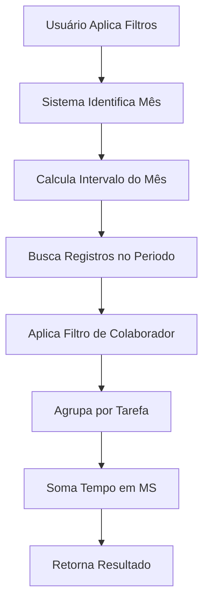

# 🔄 Especificação Técnica: Nova Lógica de Horas Realizadas

## 📋 Resumo Executivo

**Contexto:** Remodelação completa do cálculo de "Horas Realizadas" no dashboard, migrando da tabela `tarefa` para a tabela `registro_tempo`.

**Objetivo:** Implementar nova lógica baseada em registros de tempo mensais, com filtros por período e colaborador.

**Impacto:** Alteração em endpoints de API, frontend e cálculos de dashboard.

---

## 🏗️ Arquitetura Atual vs Nova

### 📊 **Sistema Atual (LEGADO)**
```
Tabela: tarefa
Campo: tempo_realizado (horas decimais)
Lógica: Soma direta das horas das tarefas
Filtros: status, período, colaborador
```

### 🔄 **Sistema Novo (A IMPLEMENTAR)**
```
Tabela: registro_tempo
Campo: tempo_realizado (milissegundos)
Campo: data_inicio (timestampz)
Campo: usuario_id (colaborador)
Campo: tarefa_id (vínculo com tarefa)
Lógica: Agrupamento por tarefa + filtros mensais
```

---

## 🗃️ Estrutura do Banco de Dados

### Tabela `registro_tempo`
```sql
CREATE TABLE registro_tempo (
    id UUID PRIMARY KEY DEFAULT gen_random_uuid(),
    tarefa_id UUID NOT NULL,
    usuario_id UUID NOT NULL,
    data_inicio TIMESTAMP WITH TIME ZONE NOT NULL,
    data_fim TIMESTAMP WITH TIME ZONE,
    tempo_realizado BIGINT NOT NULL, -- milissegundos
    descricao TEXT,
    created_at TIMESTAMP WITH TIME ZONE DEFAULT NOW(),
    updated_at TIMESTAMP WITH TIME ZONE DEFAULT NOW()
);

-- Índices para performance
CREATE INDEX idx_registro_tempo_data_inicio ON registro_tempo(data_inicio);
CREATE INDEX idx_registro_tempo_usuario_id ON registro_tempo(usuario_id);
CREATE INDEX idx_registro_tempo_tarefa_id ON registro_tempo(tarefa_id);
CREATE INDEX idx_registro_tempo_cliente_periodo ON registro_tempo(data_inicio, usuario_id);
```

---

## 🔧 Endpoints Afetados

### 1. **GET /api/clientes/:id/tempo-realizado** 
**Status:** 🔴 CRÍTICO - Requer reimplementação completa

**Nova Lógica:**
```javascript
// Entrada
{
  clienteId: "uuid",
  status: "string?", // opcional
  startDate: "YYYY-MM-DD?", // opcional
  endDate: "YYYY-MM-DD?", // opcional
  colaboradorIds: "string?" // IDs separados por vírgula, opcional
}

// Processamento
1. Buscar todas as tarefas do cliente
2. Para cada tarefa, buscar registros de tempo no período
3. Agrupar registros por tarefa (desduplicar)
4. Somar tempo_realizado em milissegundos
5. Aplicar filtros de colaborador se fornecido

// Saída
{
  success: true,
  tempo_total_ms: 7200000, // 2 horas em ms
  total_tarefas: 5,
  total_registros: 12
}
```

### 2. **GET /api/clientes/:id/colaboradores-nomes**
**Status:** 🟡 MODERADO - Ajustes necessários

**Alterações:** Manter estrutura, mas buscar dados de `registro_tempo` ao invés de `tarefa`.

### 3. **GET /api/clientes/:id/custo-realizacao**
**Status:** 🔴 CRÍTICO - Requer reimplementação

---

## 📊 Fluxo de Dados

### Sequência de Processamento


### Cálculo de Intervalo Mensal
```javascript
function calcularIntervaloMensal(ano, mes) {
    const inicio = new Date(ano, mes - 1, 1); // Primeiro dia
    const fim = new Date(ano, mes, 0, 23, 59, 59, 999); // Último dia 23:59:59.999
    
    return {
        inicio: inicio.toISOString(),
        fim: fim.toISOString()
    };
}
```

---

## 🧮 Lógica de Agrupamento

### Regra Principal
**Um registro por tarefa**, mesmo que existam múltiplos registros de tempo.

### Implementação
```javascript
// Agrupar registros por tarefa_id
const registrosAgrupados = {};

registros.forEach(registro => {
    const tarefaId = registro.tarefa_id;
    
    if (!registrosAgrupados[tarefaId]) {
        registrosAgrupados[tarefaId] = {
            tarefa_id: tarefaId,
            tempo_total_ms: 0,
            registros_count: 0
        };
    }
    
    registrosAgrupados[tarefaId].tempo_total_ms += registro.tempo_realizado;
    registrosAgrupados[tarefaId].registros_count++;
});

// Converter para array e somar total
const tempoTotalMs = Object.values(registrosAgrupados)
    .reduce((total, item) => total + item.tempo_total_ms, 0);
```

---

## 🎯 Critérios de Aceitação

### ✅ **Must Have (Obrigatório)**
- [ ] Endpoint `/api/clientes/:id/tempo-realizado` refatorado para usar `registro_tempo`
- [ ] Filtro mensal funcionando corretamente (intervalo completo do mês)
- [ ] Agrupamento por tarefa implementado
- [ ] Filtro por colaborador funcionando
- [ ] Retorno em milissegundos (sem formatação)
- [ ] Cards do dashboard atualizados com novos valores

### ⚡ **Should Have (Importante)**
- [ ] Performance otimizada com índices apropriados
- [ ] Cache de consultas mensais
- [ ] Logs detalhados para debugging
- [ ] Tratamento de erros robusto

### 💡 **Nice to Have (Desejável)**
- [ ] Exportação de relatórios mensais
- [ ] Visualização de registros por dia
- [ ] Comparação mensal (mês anterior vs atual)

---

## 🧪 Casos de Teste

### Teste 1: Filtro Mensal Simples
```
Entrada: Mês = Outubro/2024
Esperado: Retornar apenas registros de 01/10/2024 a 31/10/2024
```

### Teste 2: Filtro com Colaborador
```
Entrada: Mês = Outubro/2024, Colaborador = "123e4567-e89b-12d3-a456-426614174000"
Esperado: Retornar apenas registros do colaborador no período
```

### Teste 3: Agrupamento por Tarefa
```
Entrada: 5 registros para mesma tarefa (tempos: 1h, 2h, 30min, 1h30min, 45min)
Esperado: Retornar 1 tarefa com tempo total de 5h45min (20700000ms)
```

### Teste 4: Múltiplas Tarefas
```
Entrada: 3 tarefas com registros múltiplos cada
Esperado: Retornar 3 tarefas com somatórios individuais corretos
```

---

## 📈 Performance & Escalabilidade

### Otimizações Recomendadas
1. **Índices de Database**: Criar índices compostos para queries frequentes
2. **Paginação**: Implementar limite de registros por consulta (max 1000)
3. **Cache**: Considerar cache Redis para consultas mensais frequentes
4. **Query Otimizada**: Usar JOIN ao invés de múltiplas queries

### Query SQL Otimizada
```sql
-- Buscar tempo total por cliente no período
SELECT 
    t.cliente_id,
    COUNT(DISTINCT rt.tarefa_id) as total_tarefas,
    SUM(rt.tempo_realizado) as tempo_total_ms
FROM registro_tempo rt
INNER JOIN tarefa t ON rt.tarefa_id = t.id
WHERE rt.data_inicio >= $1 AND rt.data_inicio <= $2
  AND t.cliente_id = $3
  AND ($4::uuid IS NULL OR rt.usuario_id = $4)
GROUP BY t.cliente_id;
```

---

## 📝 Notas de Implementação

### 🚨 Pontos de Atenção
1. **Timezone**: Garantir que todas as datas estejam em UTC
2. **Performance**: Monitorar tempo de resposta com grandes volumes
3. **Conversão**: Manter consistência de milissegundos (não converter para horas)
4. **Null Safety**: Tratar casos onde não há registros no período

### 🔧 Dependências
- Manter compatibilidade com Supabase SDK existente
- Não adicionar novas bibliotecas sem aprovação
- Garantir retrocompatibilidade com frontend atual

---

## 📚 Referências

### Documentação Supabase
- [PostgreSQL Date Functions](https://www.postgresql.org/docs/current/functions-datetime.html)
- [Supabase JavaScript SDK](https://supabase.com/docs/reference/javascript/introduction)

### Código Fonte Atual
- `node.js` - Linhas 2918-3010: Lógica atual de tempo realizado
- `clientes.js` - Linhas 2240-2287: Carregamento assíncrono de horas
- `clientes.html` - Linhas 181-192: Cards de horas realizadas

---

**Data da Especificação:** Janeiro 2025
**Versão:** 1.0
**Responsável:** Equipe de Desenvolvimento UP-380